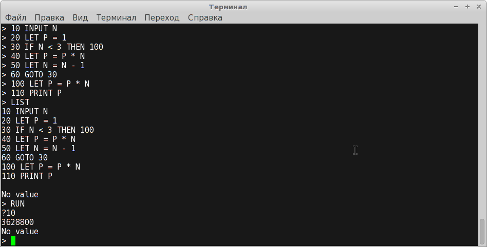

EnterpriseBasic
===============

Simple BASIC interpreter written as an exercise in core Java.

Features implemented:

- Integers. Boolean values are modelled by integers in old BASIC fashion: -1 is "true", everything else is "false".
- LET, IF ... THEN ..., GOTO, PRINT, INPUT, RUN, LIST
- Arithmetic expressions with +, -, * and parentheses.

